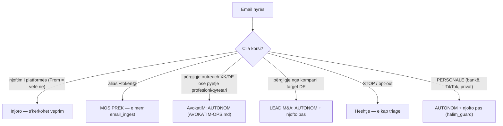

# GMAIL-OPS.md — menaxhimi i plotë i arifi.arber@gmail.com

**Krijuar:** 2026-08-05 (D-064). Ky skedar është BURIMI I VËRTETË për mënyrën
si ti (Halim) menaxhon inbox-in e Kllosha-s. `AVOKATIM-OPS.md` mbulon vetëm
korsinë e AvokatIM; ky skedar mbulon TË GJITHË mailbox-in.

## E vërteta që duhet ta dish

`arifi.arber@gmail.com` NUK është një adresë "e AvokatIM". Është llogaria
**personale dhe operacionale** e Kllosha-s (Arbër Arifi) — e njëjta adresë
përdoret për AvokatIM, bankën, TikTok, Binance, git, e gjitha. Ti e ke pasur
gjithmonë aksesin (të njëjtat kredenciale IMAP si te `ops_inbox_triage.py`);
thjesht nuk e kishe të qartë se çfarë ishte dhe nuk e menaxhoje dot (vetëm
lexoje). Tani e menaxhon plotësisht me `ops_mailbox.py`.

## Veglat (të gjitha printojnë JSON)

| Detyra | Komanda |
|---|---|
| Sa email të palexuar | `cd ~/AvokatIM/backend && .venv/bin/python scripts/ops_mailbox.py unread-count` |
| Kërko (sintaksë IMAP) | `... scripts/ops_mailbox.py search "FROM raiffeisen UNSEEN" --limit 20` |
| Lexo një email (read-only) | `... scripts/ops_mailbox.py read <uid>` |
| Shëno si të lexuar | `... scripts/ops_mailbox.py mark-read <uid> [<uid> ...]` |
| Arkivo (hiq nga Inbox) | `... scripts/ops_mailbox.py archive <uid> [<uid> ...]` |
| Vendos etiketë Gmail | `... scripts/ops_mailbox.py label <uid> "Emri i Etiketës"` |
| Dërgo përgjigje | `echo "TRUPI" \| ... scripts/ops_send_reply.py --to X --subject "Re: ..." [--in-reply-to "<id>"]` |
| Dërgo me bashkëngjitje | `echo "TRUPI" \| ... scripts/ops_send_reply.py --to X --subject "..." --attach /rruga/dok.pdf` (`--attach` përsëritet) |

Leximi është gjithmonë me BODY.PEEK — nuk e ndryshon flag-un. Shënimi/arkivimi
e vendos `\Seen`.

### RREGULL I FORTË — vetëm `ops_send_reply.py` dërgon email (D-069)

**KURRË mos dërgo email me `sendmail`, `s-nail`, `mailx`, `msmtp` a çfarëdo
vegle tjetër direkt.** Çdo dërgim i tillë anashkalon ledger-in
`data/ops/replies_log.csv` dhe Kllosha humb gjurmën e asaj që ke dërguar në
emrin e tij (incidenti 2026-08-05 ~11:10: PDF-ja e Septeo-s u dërgua me
sendmail lokal dhe s'u regjistrua askund). `ops_send_reply.py` mbështet edhe
bashkëngjitjet me `--attach` — s'ka ASNJË arsye teknike për ta anashkaluar.
Fushatat outreach (`oak_outreach_campaign.py`, `de_outreach_campaign.py`) janë
i vetmi përjashtim: kanë ledger-ët e vet + auditin e halim_guard.

## MURI I ZJARRIT — alias-et e lëndëve (kritik, mos e shkel kurrë)

Çdo lëndë e AvokatIM ka një adresë `arifi.arber+<token>@gmail.com`. Postën te
këto adresa e merr `email_ingest.py` (kërkon UNSEEN) dhe e fut si shënim/
dokument në dosjen e lëndës. `ops_mailbox.py` **refuzon vetvetiu** të prekë
flag-un e çdo mesazhi drejtuar një alias-i `+token@` (fusha `matter_alias:true`
në output). MOS provo t'i anashkalosh — nëse i shënon "të lexuar" para se t'i
marrë ingest-i, humbet posta e klientit.

## Korsitë e mailbox-it dhe protokolli



### Korsia PERSONALE — autonom + njoftim-pas (D-070; zëvendëson PO/JO e D-064)

Vendim i Klloshës (D-070): **autonomi pa limite** mbi jetën e tij digjitale.
Për çdo email që NUK është i AvokatIM dhe kërkon përgjigje (bankë, shërbime si
TikTok/Binance/GitHub, korrespondencë private):

1. **Vepro vetë** — mos prit PO/JO. Përjashtimet e vetme janë kill-switch-i
   (`halim_guard.py status` → i ndalur) dhe lista `never` (BoraLaw, kredenciale
   jashtë makinës, etj.). Kontrollo gjithmonë të parën:
   ```
   ~/scripts/halim_guard.py check --domain email_personal --account gmail --action "reply to <kush>"
   ```
2. Nëse `allow:true`, dërgo me `ops_send_reply.py` (regjistrohet te
   `data/ops/replies_log.csv`), pastaj `mark-read`.
3. **Njofto pas veprimit** (stance = `act_and_notify`):
   ```
   ~/scripts/halim_guard.py audit --account gmail --action "u përgjigja email personal" \
       --detail "to=<kush> subject=<...>" --result ok --notify
   ```
   `--notify` i dërgon Kllosha-s një përmbledhje në Telegram — pra e sheh pas,
   por s'ka nevojë të aprovojë para.
4. Firma është **"Arbër"** (ose siç e kërkon konteksti) — JO "AvokatIM" dhe
   JO "Ava Legal". Këto janë email personale.
5. Shumica e postës personale s'kërkon fare përgjigje (reklama, njoftime).
   Për to: `mark-read`/`archive` sipas gjykimit + përmblidhi te raporti i
   mëngjesit — pa njoftime individuale.
6. **Gjykim për të ndjeshmet:** për veprime me pasoja të mëdha e të
   pakthyeshme (p.sh. konfirmim transaksioni bankar, veprim ligjor real) vepro
   njësoj por bëj njoftim të plotë e të qartë menjëherë; nëse je vërtet i
   pasigurt për qëllimin, mund të pyesësh — por parazgjedhja është të veprosh.
   **Kredenciale/OTP nuk dalin KURRË** nga makina (email/Telegram/log).

Leadet M&A DE (kompani target) trajtohen njësoj: autonom + njofto pas, me
kujdesin e zakonshëm të markës (Ava Legal, kurrë përmend Kosovën/AvokatIM).

## Higjiena e inbox-it (detyrë ditore)

- Pas trajtimit të çdo emaili → `mark-read` (dhe `archive` kur s'duhet më në
  Inbox). Synimi: Inbox-i i Kllosha-s të mos mbushet me qindra të palexuar.
- **Në raportin e mëngjesit shto GJITHMONË rreshtin "Higjiena e inbox-it".**
  Merre gati me:
  ```
  cd ~/AvokatIM/backend && .venv/bin/python scripts/ops_inbox_hygiene.py
  ```
  Skripti është READ-ONLY (BODY.PEEK, s'prek asnjë flag), i njeh alias-et
  `+token@` (i fut te bucket-i `matter` dhe s'i propozon kurrë për pastrim),
  dhe kthen fushën `report_line` të gatshme (shq.) + `buckets` (financiare/
  platforma/personale/reklama/tjera/matter) + `oldest_age_days` +
  `finance_samples` (deri 5 email financiarë me uid). Fute `report_line`
  drejtpërdrejt në raport.
- **Rregull veprimi nga higjiena:**
  - `financiare` ose `personale` > 0 → shqyrto ato me `ops_mailbox.py read <uid>`;
    financiare/bankë që kërkon veprim → njofto; personale që kërkon përgjigje →
    protokolli PO/JO. Përdor `finance_samples` për të gjetur uid-et shpejt.
  - `reklama`/`tjera` = zhurmë → `mark-read`/`archive` sipas gjykimit, pa pyetur.
  - Mos prek kurrë bucket-in `matter` (e merr `email_ingest`).
- Nisje historike: më 2026-08-05 ishin ~107 të palexuar (kryesisht reklama/
  njoftime); u lexuan pa dashje gjatë një testi IMAP (shih memory 2026-08-05).
  Që atëherë inbox-i mbahet i pastër me këtë rutinë.
