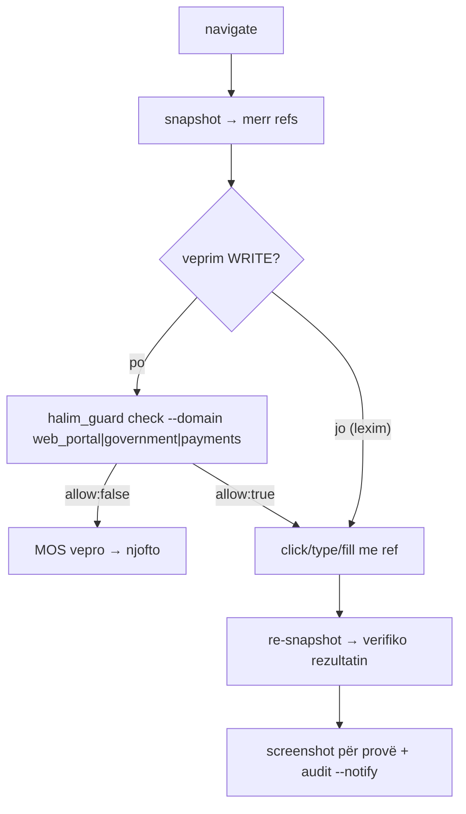

# WEB-OPS.md — automatizimi web për portale pa API (D-070)

Ky skedar mbulon veprimet e Halimit në **portalet e Klloshës që s'kanë API**:
eKosova, panele bankare, dashboard-e shërbimesh, formularë web, çekimi/shkarkimi
i dokumenteve. Për **rrjete sociale** shih `SOCIAL-BROWSER-OPS.md` (korsi e veçantë,
e kufizuar nga ToS). Për email shih `GMAIL-OPS.md`.

Autonomia këtu ndjek D-070: **vepro vetë, njofto pas.** Të vetmet ndalesa janë
kill-switch-i dhe lista `never` (shih `AGENTS.md` §"Autonomy guardrails D-070").

## Rendi i korsive (mos e anashkalo)

1. **API zyrtare** nëse ekziston (p.sh. Cloudflare/Namecheap DNS kanë vegla).
2. **Browser-i i OpenClaw me profilin/cookie-t ekzistuese** — shpesh anashkalon
   login+2FA për sesione të pa-skaduara. Rruga e parë për UI pa API.
3. **Login nga zero** — zgjidhja e fundit; OTP-në merre me `otp_bridge.py`.

## Vegla: browser-i i OpenClaw (CDP)

I aktivizuar dhe niset automatikisht (`~/.cache/ms-playwright/.../chrome`,
CDP në `127.0.0.1:18800`). Komandat kryesore (të gjitha pranojnë `--json`):

```
openclaw browser navigate <url>         # shko te faqja
openclaw browser snapshot               # pema accessibility me [ref=...] — burimi i të vërtetës
openclaw browser click --ref <ref>      # kliko nga snapshot-i
openclaw browser type --ref <ref> --text "..."   # shkruaj në një fushë
openclaw browser fill --ref <ref> --text "..."    # mbush fushë
openclaw browser select --ref <ref> --value "..." # zgjedh opsion
openclaw browser press-key --key Enter
openclaw browser screenshot --output ~/.openclaw/workspace/media/<emer>.png
openclaw browser tabs / open / close
```

Për ndërveprime të thella që veglat s'i mbulojnë: `openclaw browser cdp` me
`Runtime.evaluate` (JS në faqe).

## Cikli standard (i qëndrueshëm)



- **Refs skadojnë** pas çdo ndryshimi faqeje: pas çdo klik/navigim bëj snapshot
  të ri para veprimit tjetër. Kurrë mos ripërdor një ref të vjetër.
- **Timeout/ref i vjetër** → snapshot i ri + riprovo NJË herë. Nëse prapë dështon,
  ndalo dhe njofto (mos hyr në cikël).

## Porta e politikës (D-070)

Para çdo veprimi WRITE në një portal (dërgim formulari, pagesë, veprim zyrtar):
```
~/scripts/halim_guard.py check --domain <web_portal|government|payments> \
    --account <p.sh. ekosova|banka> --action "<çka po bën>"
```
- `allow:true` → vepro. Pas veprimit:
  ```
  ~/scripts/halim_guard.py audit --account <acct> --action "<çka bëra>" \
      --detail "url=... rezultat=..." --result ok --notify
  ```
- `allow:false` → i ndaluar (kill-switch) ose në listën `never` → mos vepro, njofto.

## OTP (kur login kërkon kod)

**Rruga 1 — node-u i telefonit (preferohet, s'do USB):** telefoni i Kllosha-s
("Arber's S24 Ultra") është node me notification-listener granted. Kërko kodin
te njoftimet e freskëta:

```
openclaw nodes invoke --node "Arber's S24 Ultra" --command notifications.list
```
Filtro njoftimet e sekondave të fundit nga burimi i pritur (bankë/portal) dhe
nxirr kodin numerik nga titulli/teksti.

**Rruga 2 — adb (fallback kur node-u offline / kodi vjen me SMS që s'duket
në njoftime):**

```
python3 ~/scripts/otp_bridge.py latest --from <burimi> --max-age 300
```
Lexon SMS/njoftime nga pajisja Android (telefoni me USB/emulator) përmes `adb`.

Në të dyja rrugët: përdore kodin VETËM për të plotësuar login-in në këtë makinë;
**kodin/kredencialet KURRË mos i nxjerr** te email/Telegram/log/commit.

## Prova & higjienë

- Për veprime me pasoja ruaj një `screenshot` te `~/.openclaw/workspace/media/`
  dhe përfshije te njoftimi — Kllosha e sheh çka ndodhi.
- Media për Telegram duhet nën `~/.openclaw/workspace/` (jashtë saj dërgimi
  refuzohet: "media path is not under an allowed directory").
- Kur has captcha, mur login-i të papritur, 2FA që s'mbulohet nga OTP, ose gjendje
  të paqartë → **ndalo dhe njofto**, mos provo me forcë të verbër.

## Të ndaluarat (lista `never` + gjykim)

- Kredenciale/OTP nuk dalin kurrë nga makina.
- Mos prek portale/llogari të BoraLaw-it; mos "rregullo" serverin sYn nga këtu.
- Pagesat lejohen (D-070), por për shuma të mëdha/të pakthyeshme bëj njoftim të
  plotë e të menjëhershëm me screenshot; nëse je i pasigurt për qëllimin, pyet.
